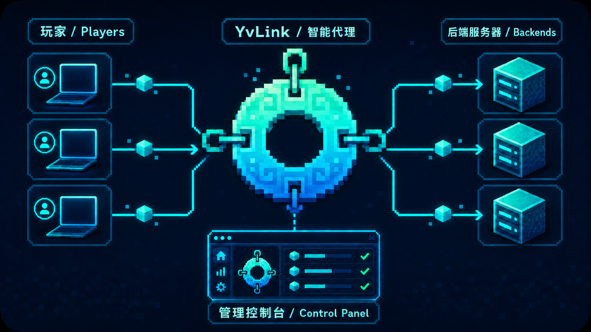

<div align="center">
  
  <h1>YvLink · mc-proxy</h1>
  <p>
    Minecraft Java 协议感知转发器与 Web 管理控制台<br>
    Protocol-aware Minecraft Java proxy with a web control panel
  </p>
  <p>
    <a href="#中文">中文</a> ·
    <a href="#english">English</a> ·
    <a href="https://baiyun1123.github.io/YvLink/">API Docs</a> ·
    <a href="MODDED_COMPATIBILITY.md">Modded Compatibility</a> ·
    <a href="CROSSPLAY.md">Crossplay</a>
  </p>
</div>



---

<a id="中文"></a>

# 中文

## 项目简介

YvLink（程序包名 `mc-proxy`）是一款使用 Rust 与 Tokio 构建的高性能 Minecraft Java TCP 转发器。它会解析连接初期的 Handshake、Status 和 Login Start，根据客户端访问的域名选择后端，并在选路完成后透明转发后续游戏与模组协议。

项目同时提供内置 Web 管理控制台，可在线管理路由、后端池、状态响应、白名单、健康检查和跨平台互通配置，无需手工修改 TOML 后重启服务。

当前开发版本：**v0.15.0**

## 下载

正式安装包请从 [GitHub Releases](https://github.com/baiyun1123/YvLink/releases/latest) 下载，不要使用 GitHub 自动生成的 `Source code (zip)` 作为安装包。

| 文件 | 适用环境 |
| --- | --- |
| `YvLink-ubuntu-22.04-x86_64.tar.gz` | Ubuntu 22.04 或兼容的 x86_64 glibc Linux |
| `YvLink-ubuntu-24.04-x86_64.tar.gz` | Ubuntu 24.04 或更新的 x86_64 glibc Linux |
| `YvLink-linux-musl-x86_64.tar.gz` | Alpine 及多数 x86_64 Linux 发行版的便携版本 |
| `YvLink-linux-musl-aarch64.tar.gz` | ARM64 Linux、ARM 服务器和树莓派 64 位系统 |
| `YvLink-windows-2022-x86_64.zip` | 64 位 Windows |

## 主要功能

- 单端口多域名路由，支持精确 Host、`*`/`?` 通配符和默认兜底规则。
- 单路由最多 128 个后端，支持顺序、随机、轮询、最少连接和最低延迟策略。
- 后端连接失败自动故障转移；可选 TCP 或 Minecraft Status 协议级主动健康检查。
- 支持自定义服务器列表状态，或透传后端状态并按需覆盖字段。
- 保留 Forge、NeoForge 状态扩展、favicon、玩家 sample 和未知 JSON 字段。
- 支持登录前玩家名白名单和自定义拒绝消息。
- 支持 PROXY Protocol v1/v2，将真实连接地址传给明确兼容的受信任后端。
- 对原版、Fabric、Forge 与 NeoForge 后续协议执行双向透明转发。
- Web 控制台提供配置管理、运行指标、后端健康状态和 60 秒实时吞吐曲线。
- 管理 API 使用 Bearer Token；配置变更通过临时文件和原子重命名持久化。
- Bedrock 互通支持两种提供方：外部 Geyser Standalone 独立进程，或由 YvLink 直接托管的 GeyserLite（无需 JVM）；统一通过真实 RakNet Pong 检查状态。
- 可选托管 ViaLite：以隔离子进程在选路后把 Java 连接转到不同版本的后端；运行时状态和配置可在控制台查看。
- 提供校验、原子替换与失败回滚的 systemd 自动更新器，无需服务器重新拉取源码再部署。
- 支持 Ctrl+C/SIGTERM 优雅退出、连接数限制、超时控制和 Linux/Android `SO_REUSEPORT`。

## 工作方式

```text
Java 客户端
    │  TCP :25565（Handshake 中携带访问域名）
    ▼
YvLink
    ├─ 按规则顺序匹配 Host
    ├─ 按策略选择健康后端
    ├─ 可处理 Status / 白名单
    └─ 透明转发后续协议
        ├─ 后端 A
        ├─ 后端 B
        └─ 后端 C

浏览器 ── HTTP :18080 / HTTPS 反代 ── Web 控制台与管理 API
```

同一入口可承载多个域名。客户端连接时，代理读取 Minecraft Handshake 中的 virtual host，选择首个匹配规则，再从该规则的后端池中选择节点。若首选节点连接失败，会继续尝试池内其他节点。

## 所需环境

### 开发与本地运行

| 项目 | 要求 |
| --- | --- |
| Rust | 1.88 或更高版本 |
| Cargo | 随 Rust toolchain 安装 |
| 操作系统 | Linux 推荐；其他支持 Rust/Tokio 的平台可自行构建 |
| 管理令牌 | 环境变量 `MC_PROXY_ADMIN_TOKEN`，至少 32 个字符 |
| Node.js | 仅在执行前端 JavaScript 语法检查时需要 |

安装 Rust：

```sh
curl --proto '=https' --tlsv1.2 -sSf https://sh.rustup.rs | sh
rustc --version
cargo --version
```

### 可选生产组件

| 组件 | 用途 |
| --- | --- |
| Nginx | 为仅监听回环地址的管理端提供 HTTPS 反向代理 |
| systemd | 服务守护、自动重启和开机启动 |
| Certbot | 申请与续期 Let’s Encrypt 证书 |
| Java 21 + Geyser Standalone | 仅在 provider = "external" 的 Bedrock 互通时使用 |
| GeyserLite 构建特性 | provider = "geyserlite" 时由 YvLink 托管，无需 JVM |
| ViaLite（可选） | Java 后端版本兼容；由 `deploy/install-vialite.sh` 安装为隔离子进程 |

## 快速启动

### 1. 获取并编译

```sh
git clone <你的仓库地址>
cd mc-proxy
cargo build --release
```

如果你已经位于项目目录，只需执行：

```sh
cargo build --release
```

Bedrock 互通默认使用 GeyserLite（默认特性 `geyserlite` + `geyserlite-download`，运行时会自动获取原生库并校验 SHA-256；内置翻译层仅编译进 Linux 目标，Windows 包请使用外部 Geyser Standalone）。其他构建方式：

```sh
# 把 libgeyserlite.so 内嵌进二进制，适合离线生产环境
cargo build --release --features geyserlite-embed
# 完全移除内置翻译层，只保留外部 Geyser Standalone 监控
cargo build --release --no-default-features
```

### 2. 创建配置

```sh
cp config.example.toml config.toml
```

至少修改一条 `[[rules]]` 的 `host` 和 `backend`。如果还没准备好真实后端，可先设置：

```toml
[settings]
proxy_enabled = false
```

这样可以只启动管理控制台，避免开放一个无可用后端的 Minecraft 入口。

### 3. 设置管理令牌

生成随机令牌：

```sh
openssl rand -hex 32
```

仅为当前终端设置：

```sh
export MC_PROXY_ADMIN_TOKEN='替换为至少32个字符的高强度随机令牌'
export RUST_LOG='mc_proxy=info'
```

不要把令牌提交到 Git、写入公开 README 或放进前端源码。

### 4. 启动

使用已编译的二进制：

```sh
./target/release/mc-proxy --config config.toml
```

也可以直接通过 Cargo 编译并运行：

```sh
MC_PROXY_ADMIN_TOKEN='替换为至少32个字符的高强度随机令牌' \
RUST_LOG='mc_proxy=info' \
cargo run --release -- --config config.toml
```

默认地址：

- Minecraft Java 入口：`0.0.0.0:25565`
- Web 管理端：`http://127.0.0.1:18080`
- 健康检查：`http://127.0.0.1:18080/healthz`
- API 文档：`http://127.0.0.1:18080/docs/api`

停止服务时按 `Ctrl+C`，程序会等待现有连接在宽限期内结束。

## 配置说明

完整、带注释的配置见 [`config.example.toml`](config.example.toml)。最小示例：

```toml
[admin]
listen = "127.0.0.1:18080"

[crossplay]
enabled = false
provider = "external"
bedrock_listen = "0.0.0.0:19132"
java_address = "bedrock.example.com"
java_port = 25565
auth_type = "online"

[crossplay.geyserlite]
mode = "embedded"
offline = false
motd_line1 = "YvLink"
motd_line2 = "Bedrock via GeyserLite"

[via]
enabled = false
# binary_path = "/opt/mc-proxy/vialite/vialite"
runtime_dir = "/run/mc-proxy/vialite"
gate_protocol = "auto"
backend_version = "auto"

[settings]
listen = "0.0.0.0:25565"
proxy_enabled = true
max_connections = 10000
connect_timeout_ms = 5000
handshake_timeout_ms = 5000
shutdown_grace_secs = 30
copy_buffer_bytes = 32768
socket_buffer_bytes = 1048576
listen_backlog = 4096
tcp_nodelay = true
reuse_port = false
stats_interval_secs = 10

[[rules]]
id = "survival"
name = "生存服"
host = ["play.example.com", "*.play.example.com"]
backend = ["10.0.0.2:25565", "10.0.0.3:25565"]
strategy = "least-connections"
proxy_protocol = "off"
modify_virtual_host = false
whitelist_enabled = false
whitelist = []
crossplay_enabled = false
enabled = true

[rules.health_check]
enabled = true
mode = "minecraft-status"
interval_secs = 30
timeout_ms = 2000
unhealthy_threshold = 3
healthy_threshold = 2
minecraft_protocol = 769

[rules.status]
mode = "backend"
cache_ttl_secs = 30

[rules.status.fallback]
motd = "§c服务器暂时离线"
version_name = "后端不可用"
protocol = -1
online = 0
max = 100
```

### 关键配置

| 配置 | 说明 |
| --- | --- |
| `admin.listen` | Web 管理端监听地址；生产环境建议保持回环地址 |
| `settings.listen` | 所有 Java 域名共用的 TCP 入口 |
| `settings.proxy_enabled` | 是否启用 Minecraft 转发入口 |
| `rules.host` | 单个 Host 或 Host 数组，按规则出现顺序匹配 |
| `rules.backend` | 单个后端或后端数组，格式为 `host:port` |
| `rules.strategy` | `sequential`、`random`、`round-robin`、`least-connections` 或 `lowest-latency` |
| `rules.modify_virtual_host` | 是否将握手 Host 改写为后端主机名 |
| `rules.crossplay_enabled` | 是否允许该已启用路由作为全局 Bedrock Crossplay 的 Java 上游；默认 `false` |
| `rules.proxy_protocol` | `off`、`v1` 或 `v2`；普通服务端通常必须保持 `off` |
| `rules.health_check.mode` | `tcp` 只检查端口；`minecraft-status` 验证 Status JSON 与 Ping/Pong |
| `rules.status.mode` | `custom` 由代理生成状态；`backend` 保留后端状态并覆盖指定字段 |
| `via.enabled` | 启用 ViaLite Java 后端版本兼容；需要已安装的绝对 `binary_path` |
| `via.backend_version` | 目标后端版本，`auto` 时由 ViaLite 检测；被后端拦截 Status 时应显式指定 |

规则按文件中的先后顺序匹配，因此 `host = "*"` 的兜底规则必须放在最后。

### ViaLite Java 后端版本兼容

ViaLite 的拓扑是 `Java/Bedrock 玩家 → YvLink（选路）→ ViaLite → Java 后端`。它不替代 Geyser：GeyserLite 负责 Bedrock 到 Java 会话，ViaLite 仅处理进入后端后的 Java 协议差异。生产环境使用本项目的 subprocess 托管模式，避免原生运行时崩溃带走代理；每个真实后端会映射到仅回环可见的入口。

先以 root 安装并校验官方发布物，再在控制台或配置中启用：

```sh
install -m 0755 deploy/install-vialite.sh /usr/local/lib/mc-proxy/install-vialite.sh
/usr/local/lib/mc-proxy/install-vialite.sh
```

启用 ViaLite 时，所有路由的 `proxy_protocol` 必须是 `off`；YvLink 当前不提供 Velocity/Bungee 身份转发，ViaLite 会明确以 `forwarding = none` 启动。客户端无法被 YvLink 解析时，ViaLite 也不能把它变为可接入客户端。

### 自动升级

自动升级器只下载 GitHub Release 的 Ubuntu 24.04 x86_64 安装包，先验证二进制 `--version` 与 Release 标签一致，再原子替换；服务无法健康重启会自动恢复上一份二进制。它不会执行 `git pull`，也不会触碰 `/etc/mc-proxy/config.toml`。

```sh
install -m 0755 deploy/mc-proxy-update.sh /usr/local/lib/mc-proxy/mc-proxy-update.sh
install -m 0644 deploy/mc-proxy-update.service /etc/systemd/system/
install -m 0644 deploy/mc-proxy-update.timer /etc/systemd/system/
systemctl daemon-reload
systemctl enable --now mc-proxy-update.timer
# 可按需立即检查一次
systemctl start mc-proxy-update.service
```

状态写入 `/var/lib/mc-proxy/update-status.json`，可用 `systemctl status mc-proxy-update.service` 或 `journalctl -u mc-proxy-update.service` 排查。

### NotEnoughBandwidth（NEB）

[NotEnoughBandwidth](https://github.com/USS-Shenzhou/NotEnoughBandwidth) 是 Fabric 游戏端/服务端模组，优化的是连接与模组包编码、聚合压缩和区块缓存，不能作为 Rust 代理库直接嵌入 YvLink。应在实际 Fabric 后端与需要其协议的客户端成对安装；若流量经过 Velocity 或本项目的协议兼容层，请先在测试服验证，并使用其兼容模式与黑名单。YvLink 保持对后续模组数据透明转发，不声称替代 NEB。

## Web 控制台与 API

管理端默认只监听 `127.0.0.1:18080`。浏览器首次访问时输入与 `MC_PROXY_ADMIN_TOKEN` 相同的令牌，令牌仅保存在当前标签页的 `sessionStorage` 中。

生产环境建议通过 Nginx 暴露 HTTPS，不要直接将管理端绑定到公网地址。仓库已提供：

- [`deploy/nginx-mc.lic6.top.conf`](deploy/nginx-mc.lic6.top.conf)：Nginx 反向代理示例。
- [`deploy/nginx-rate-limit.conf`](deploy/nginx-rate-limit.conf)：API 限速示例。
- [`docs/api.html`](docs/api.html)：响应式、可搜索的 API 文档。
- <https://baiyun1123.github.io/YvLink/>：由 GitHub Actions 自动部署的在线 API 文档。

公开演示管理地址：<https://mc.lic6.top>

## 生产部署

Ubuntu 24.04 的详细构建与验收流程见 [`BUILD_UBUNTU24.md`](BUILD_UBUNTU24.md)。推荐布局：

```text
/opt/mc-proxy/mc-proxy
/etc/mc-proxy/config.toml
/etc/mc-proxy/admin.env
/etc/systemd/system/mc-proxy.service
```

创建令牌文件：

```sh
sudo install -d -m 0750 /etc/mc-proxy
sudo sh -c "umask 077; printf '%s\n' 'MC_PROXY_ADMIN_TOKEN=替换为高强度随机令牌' > /etc/mc-proxy/admin.env"
```

安装并启动 systemd 服务前，请检查 [`deploy/mc-proxy.service`](deploy/mc-proxy.service) 中的用户、路径和权限是否符合你的服务器：

```sh
sudo cp deploy/mc-proxy.service /etc/systemd/system/mc-proxy.service
sudo systemctl daemon-reload
sudo systemctl enable --now mc-proxy
sudo systemctl status mc-proxy
```

常用运维命令：

```sh
journalctl -u mc-proxy -f
systemctl restart mc-proxy
nginx -t
certbot certificates
```

需要放行的端口取决于部署方式：

- `25565/tcp`：Minecraft Java 公网入口。
- `80/tcp`、`443/tcp`：Nginx HTTP/HTTPS。
- `19132/udp`：仅在配置并启用 Bedrock 互通入口（external 或 geyserlite）时需要。
- `18080/tcp`：建议只监听回环地址，不在防火墙中对公网开放。

## 验证与测试

```sh
cargo fmt --check
cargo clippy --all-targets -- -D warnings
cargo test --all-targets
node --check web/app.js
```

检查运行状态：

```sh
curl -fsS http://127.0.0.1:18080/healthz
```

## 模组与跨平台兼容边界

- 代理会保留 Forge/FML Handshake Host 中的 NUL 扩展，并透明传递后续 Fabric、Forge 和 NeoForge 数据。
- 当前能力是“薄代理”：不会终止在线模式认证，也不会生成 Velocity modern forwarding 或 BungeeCord 玩家信息。
- 白名单只是后端认证前的快速筛选，不能代替 Minecraft 在线模式身份认证。
- PROXY Protocol 只传递源/目标地址，不转换 Java 协议版本，也不代替 Velocity/Bungee 转发协议。
- Minecraft Status 健康检查只证明列表协议可用，不代表玩家可以完成认证、模组协商或进入游戏。
- Bedrock 客户端可通过外部 Geyser Standalone 或内置 GeyserLite 接入（GeyserLite 仅 Linux 目标可用）；GeyserLite 由 YvLink 托管时默认内嵌进程内加载，原生库崩溃会终止整个进程且配置变更需重启服务生效，生产可用 subprocess 模式换取隔离与在线热更新。

详细说明：

- [`MODDED_COMPATIBILITY.md`](MODDED_COMPATIBILITY.md)：原版、Fabric、Forge、NeoForge 兼容矩阵与限制。
- [`CROSSPLAY.md`](CROSSPLAY.md)：Geyser/Floodgate 架构、认证方式与部署建议。
- [`tests/MODDED_MATRIX_RUNBOOK.md`](tests/MODDED_MATRIX_RUNBOOK.md)：真实加载器服务端矩阵复现手册。

## 性能调优

默认每个连接的每个方向使用 32 KiB 用户态缓冲区。流量指标在数据成功写入另一端后按块累加，不必等待长连接断开。

生产调优应使用真实 Minecraft 协议客户端逐步测试 16、32、64 和 128 KiB 缓冲区，不要使用 HTTP 压测工具代替游戏协议负载。提高 `max_connections` 前，也要同步检查系统文件描述符限制、内存和后端容量。

## 许可证

YvLink 使用 [GNU Affero General Public License v3.0 only](LICENSE)（`AGPL-3.0-only`）。

- 允许个人和企业使用、修改、分发及商业化。
- 分发修改版本时，必须按照 AGPL v3 提供对应源代码并保留许可证声明。
- 如果修改后的版本通过网络与用户交互，必须向这些用户免费提供该版本的对应源代码。
- `YvLink` 项目名称和图标不因本软件许可证而授予商标使用权。

---

<a id="english"></a>

# English

## Overview

YvLink (package name: `mc-proxy`) is a high-performance Minecraft Java TCP forwarding proxy built with Rust and Tokio. It parses the initial Handshake, Status, and Login Start packets, selects a backend using the hostname requested by the client, and transparently relays subsequent game and mod-loader traffic.

An embedded web control panel lets operators manage routes, backend pools, status responses, allowlists, health checks, and crossplay settings without manually editing TOML and restarting the service.

Current development version: **v0.15.0**

## Downloads

Download installable packages from [GitHub Releases](https://github.com/baiyun1123/YvLink/releases/latest). GitHub’s automatically generated `Source code (zip)` archive is not an installation package.

| File | Platform |
| --- | --- |
| `YvLink-ubuntu-22.04-x86_64.tar.gz` | Ubuntu 22.04 or compatible x86_64 glibc Linux |
| `YvLink-ubuntu-24.04-x86_64.tar.gz` | Ubuntu 24.04 or newer x86_64 glibc Linux |
| `YvLink-linux-musl-x86_64.tar.gz` | Portable x86_64 build for Alpine and most Linux distributions |
| `YvLink-linux-musl-aarch64.tar.gz` | ARM64 Linux, ARM servers, and 64-bit Raspberry Pi systems |
| `YvLink-windows-2022-x86_64.zip` | 64-bit Windows |

## Features

- Host-based routing through one public port, including exact hosts, `*`/`?` wildcards, and a default fallback rule.
- Up to 128 backends per route with sequential, random, round-robin, least-connections, and lowest-latency strategies.
- Automatic connection failover plus optional TCP or Minecraft Status protocol health checks.
- Fully custom server-list responses, or backend responses with selective field overrides.
- Preservation of Forge/NeoForge extensions, favicon, player samples, and unknown Status JSON fields.
- Pre-login player-name allowlists with customizable disconnect messages.
- PROXY Protocol v1/v2 for trusted backends that explicitly support it.
- Transparent bidirectional forwarding for Vanilla, Fabric, Forge, and NeoForge traffic after routing.
- Web-based configuration, runtime metrics, backend health details, and a 60-second live throughput chart.
- Bearer-token protected management API and atomic configuration persistence.
- Bedrock crossplay with two providers: an external Geyser Standalone process, or a GeyserLite instance managed directly by YvLink (no JVM required); both are verified with a real RakNet Pong probe.
- Graceful Ctrl+C/SIGTERM shutdown, connection limits, timeouts, and optional Linux/Android `SO_REUSEPORT`.

## How It Works

```text
Java clients
    │  TCP :25565 (requested hostname in Handshake)
    ▼
YvLink
    ├─ matches Host rules in order
    ├─ selects a healthy backend
    ├─ optionally handles Status / allowlist
    └─ transparently relays later packets
        ├─ Backend A
        ├─ Backend B
        └─ Backend C

Browser ── HTTP :18080 / HTTPS reverse proxy ── Web UI and management API
```

Multiple domains can share the same listener. YvLink reads the virtual host from the Minecraft Handshake, uses the first matching rule, and selects a node from that rule’s backend pool. If the preferred node cannot be reached, the remaining nodes are tried automatically.

## Requirements

### Development and Local Use

| Item | Requirement |
| --- | --- |
| Rust | 1.88 or newer |
| Cargo | Installed with the Rust toolchain |
| Operating system | Linux recommended; other Rust/Tokio platforms may build from source |
| Admin token | `MC_PROXY_ADMIN_TOKEN`, at least 32 characters |
| Node.js | Only needed for the optional frontend JavaScript syntax check |

Install Rust:

```sh
curl --proto '=https' --tlsv1.2 -sSf https://sh.rustup.rs | sh
rustc --version
cargo --version
```

### Optional Production Components

| Component | Purpose |
| --- | --- |
| Nginx | HTTPS reverse proxy for the loopback-only management listener |
| systemd | Service supervision, restart policy, and start on boot |
| Certbot | Let’s Encrypt certificate issuance and renewal |
| Java 21 + Geyser Standalone | Bedrock connectivity only with `provider = "external"` |
| GeyserLite build feature | Managed Bedrock translator with `provider = "geyserlite"`, no JVM needed |

## Quick Start

### 1. Clone and Build

```sh
git clone <your-repository-url>
cd mc-proxy
cargo build --release
```

Bedrock crossplay uses GeyserLite by default (default features `geyserlite` + `geyserlite-download`; the native library is fetched at runtime and verified with SHA-256. The managed translator is compiled only for Linux targets; Windows packages use the external Geyser Standalone). Other build modes:

```sh
# Embed libgeyserlite.so into the binary, suitable for offline production
cargo build --release --features geyserlite-embed
# Remove the managed translator entirely, keeping only external Geyser monitoring
cargo build --release --no-default-features
```

If you are already in the project directory:

```sh
cargo build --release
```

### 2. Create a Configuration

```sh
cp config.example.toml config.toml
```

Update at least one `[[rules]]` entry with your real `host` and `backend`. If no backend is ready yet, start with:

```toml
[settings]
proxy_enabled = false
```

This starts the control panel without exposing a Minecraft listener that has no usable backend.

### 3. Set the Admin Token

Generate a random token:

```sh
openssl rand -hex 32
```

Export it for the current shell:

```sh
export MC_PROXY_ADMIN_TOKEN='replace-with-a-strong-token-of-at-least-32-characters'
export RUST_LOG='mc_proxy=info'
```

Never commit this token to Git, publish it in documentation, or embed it in frontend code.

### 4. Run

Run the release binary:

```sh
./target/release/mc-proxy --config config.toml
```

Or build and run through Cargo:

```sh
MC_PROXY_ADMIN_TOKEN='replace-with-a-strong-token-of-at-least-32-characters' \
RUST_LOG='mc_proxy=info' \
cargo run --release -- --config config.toml
```

Default endpoints:

- Minecraft Java listener: `0.0.0.0:25565`
- Web control panel: `http://127.0.0.1:18080`
- Health endpoint: `http://127.0.0.1:18080/healthz`
- API documentation: `http://127.0.0.1:18080/docs/api`

Press `Ctrl+C` to stop the service gracefully.

## Configuration

See [`config.example.toml`](config.example.toml) for the complete commented example. A minimal multi-backend route:

```toml
[admin]
listen = "127.0.0.1:18080"

[crossplay]
enabled = false
provider = "external"
bedrock_listen = "0.0.0.0:19132"
java_address = "bedrock.example.com"
java_port = 25565
auth_type = "online"

[crossplay.geyserlite]
mode = "embedded"
offline = false
motd_line1 = "YvLink"
motd_line2 = "Bedrock via GeyserLite"

[settings]
listen = "0.0.0.0:25565"
proxy_enabled = true
max_connections = 10000
connect_timeout_ms = 5000
handshake_timeout_ms = 5000
shutdown_grace_secs = 30
copy_buffer_bytes = 32768
socket_buffer_bytes = 1048576
listen_backlog = 4096
tcp_nodelay = true
reuse_port = false
stats_interval_secs = 10

[[rules]]
id = "survival"
name = "Survival"
host = ["play.example.com", "*.play.example.com"]
backend = ["10.0.0.2:25565", "10.0.0.3:25565"]
strategy = "least-connections"
proxy_protocol = "off"
modify_virtual_host = false
whitelist_enabled = false
whitelist = []
crossplay_enabled = false
enabled = true

[rules.health_check]
enabled = true
mode = "minecraft-status"
interval_secs = 30
timeout_ms = 2000
unhealthy_threshold = 3
healthy_threshold = 2
minecraft_protocol = 769

[rules.status]
mode = "backend"
cache_ttl_secs = 30

[rules.status.fallback]
motd = "§cServer temporarily offline"
version_name = "Backend unavailable"
protocol = -1
online = 0
max = 100
```

### Important Options

| Option | Description |
| --- | --- |
| `admin.listen` | Web management listener; keep it on loopback in production |
| `settings.listen` | Shared TCP listener for all Java hostnames |
| `settings.proxy_enabled` | Enables or disables the Minecraft forwarding listener |
| `rules.host` | One host or a host array; rules are matched in file order |
| `rules.backend` | One backend or a backend array, formatted as `host:port` |
| `rules.strategy` | `sequential`, `random`, `round-robin`, `least-connections`, or `lowest-latency` |
| `rules.modify_virtual_host` | Rewrites the Handshake host to the backend hostname |
| `rules.crossplay_enabled` | Allows this enabled route to serve as the Java upstream for global Bedrock Crossplay; defaults to `false` |
| `rules.proxy_protocol` | `off`, `v1`, or `v2`; ordinary Minecraft servers normally require `off` |
| `rules.health_check.mode` | `tcp` checks reachability; `minecraft-status` validates Status JSON and Ping/Pong |
| `rules.status.mode` | `custom` generates a response; `backend` preserves the backend response and overrides selected fields |

Rules are evaluated in file order. A catch-all rule using `host = "*"` must therefore be placed last.

## Web Control Panel and API

The management server listens on `127.0.0.1:18080` by default. Enter the same token as `MC_PROXY_ADMIN_TOKEN` when the browser asks for it. The token is stored only in the current tab’s `sessionStorage`.

Use Nginx to expose the control panel over HTTPS in production. Do not bind the management listener directly to a public interface. Included resources:

- [`deploy/nginx-mc.lic6.top.conf`](deploy/nginx-mc.lic6.top.conf): Nginx reverse-proxy example.
- [`deploy/nginx-rate-limit.conf`](deploy/nginx-rate-limit.conf): API rate-limit example.
- [`docs/api.html`](docs/api.html): responsive, searchable API documentation.
- <https://baiyun1123.github.io/YvLink/>: online API documentation deployed automatically by GitHub Actions.

Public management demo: <https://mc.lic6.top>

## Production Deployment

See [`BUILD_UBUNTU24.md`](BUILD_UBUNTU24.md) for the complete Ubuntu 24.04 build and verification procedure. Recommended layout:

```text
/opt/mc-proxy/mc-proxy
/etc/mc-proxy/config.toml
/etc/mc-proxy/admin.env
/etc/systemd/system/mc-proxy.service
```

Create the token environment file:

```sh
sudo install -d -m 0750 /etc/mc-proxy
sudo sh -c "umask 077; printf '%s\n' 'MC_PROXY_ADMIN_TOKEN=replace-with-a-strong-random-token' > /etc/mc-proxy/admin.env"
```

Before installing the unit, review the user, paths, and permissions in [`deploy/mc-proxy.service`](deploy/mc-proxy.service):

```sh
sudo cp deploy/mc-proxy.service /etc/systemd/system/mc-proxy.service
sudo systemctl daemon-reload
sudo systemctl enable --now mc-proxy
sudo systemctl status mc-proxy
```

Common operations:

```sh
journalctl -u mc-proxy -f
systemctl restart mc-proxy
nginx -t
certbot certificates
```

Open only the ports required by your deployment:

- `25565/tcp`: public Minecraft Java listener.
- `80/tcp`, `443/tcp`: Nginx HTTP/HTTPS.
- `19132/udp`: only when a Bedrock crossplay listener (external or geyserlite) is configured and enabled.
- `18080/tcp`: keep this on loopback; do not expose it publicly through the firewall.

## Verification

```sh
cargo fmt --check
cargo clippy --all-targets -- -D warnings
cargo test --all-targets
node --check web/app.js
```

Check a running instance:

```sh
curl -fsS http://127.0.0.1:18080/healthz
```

## Modded and Crossplay Boundaries

- Forge/FML NUL extensions in the Handshake host are preserved, and later Fabric, Forge, and NeoForge traffic is relayed transparently.
- This is currently a thin proxy: it does not terminate online-mode authentication or generate Velocity modern forwarding/BungeeCord player data.
- The allowlist is only an early filter before backend authentication; it is not a substitute for Minecraft online-mode identity verification.
- PROXY Protocol only carries source/destination addresses. It does not translate Java protocol versions or replace Velocity/Bungee forwarding.
- A Minecraft Status health check proves only that the server-list protocol works. It does not prove successful authentication, mod negotiation, or gameplay.
- Bedrock clients can connect through an external Geyser Standalone or the managed GeyserLite translator (Linux targets only). In embedded mode GeyserLite shares the YvLink process, so a native crash terminates the whole process and config changes require a service restart; use subprocess mode for isolation and live updates.

Further reading:

- [`MODDED_COMPATIBILITY.md`](MODDED_COMPATIBILITY.md): Vanilla, Fabric, Forge, and NeoForge compatibility matrix and limitations.
- [`CROSSPLAY.md`](CROSSPLAY.md): Geyser/Floodgate architecture, authentication, and deployment.
- [`tests/MODDED_MATRIX_RUNBOOK.md`](tests/MODDED_MATRIX_RUNBOOK.md): reproducible real mod-loader server matrix.

## Performance Notes

Each connection uses a 32 KiB userspace buffer per direction by default. Traffic metrics are incremented when bytes are successfully written to the opposite side, so long-lived connections do not need to close before the dashboard updates.

Tune 16, 32, 64, and 128 KiB buffers using real Minecraft protocol clients. Do not use an HTTP benchmark as a substitute for game-protocol traffic. Before raising `max_connections`, review file-descriptor limits, memory, and backend capacity.

## License

YvLink is licensed under the [GNU Affero General Public License v3.0 only](LICENSE) (`AGPL-3.0-only`).

- Personal, corporate, modified, redistributed, and commercial use is permitted.
- Modified distributions must provide the corresponding source and preserve the license notices as required by AGPL v3.
- If a modified version interacts with users over a network, those users must be offered its corresponding source at no charge.
- This software license does not grant permission to use the `YvLink` project name or logo as a trademark.
